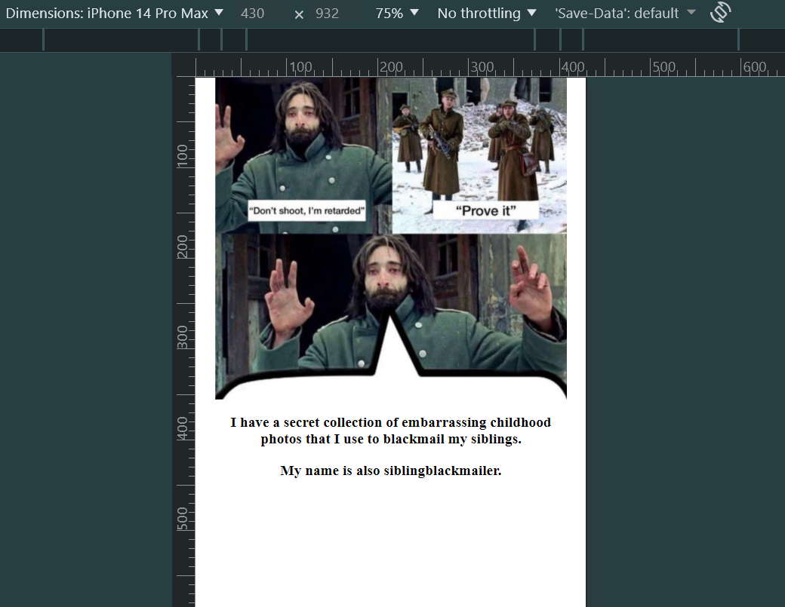

# HumStory
"Ye shall know the truth, and the truth shall make you free" John 8:32 

## What is this?
HumStory.fun, no I didn't register the domain name, is a simple project made with a bit of lazyness but can definitely make you smile. You refresh the home page and you get a Random Confession. 

Thanks to Angela from https://appbrewery.com/ for providing the api through the url 
"https://secrets-api.appbrewery.com/"

## Features
- No Authentication required.
- We get a random story by hitting this URL with the /random endpoint with a GET method.
- We receive some random data back and we only render the secret and the username on the Homepage. 
- Hope it made someone smile. 😊

## Tech used
Javascript

NodeJS  v24.13.0 https://nodejs.org/

Nodemon v3.1.11  https://www.npmjs.com/package/nodemon  (optional)

Express v5.2.1   https://www.npmjs.com/package/express

EJS     v3.1.10  https://www.npmjs.com/package/ejs

Axios   v1.13.2  https://www.npmjs.com/package/axios

## Installation
Make sure you're in the root directory then run 

|  npm i  | or |  npm install  | to install the express, ejs and axios dependencies.

|  node index.js  | or |  nodemon index.js  | to start the server.

## Usage Example

